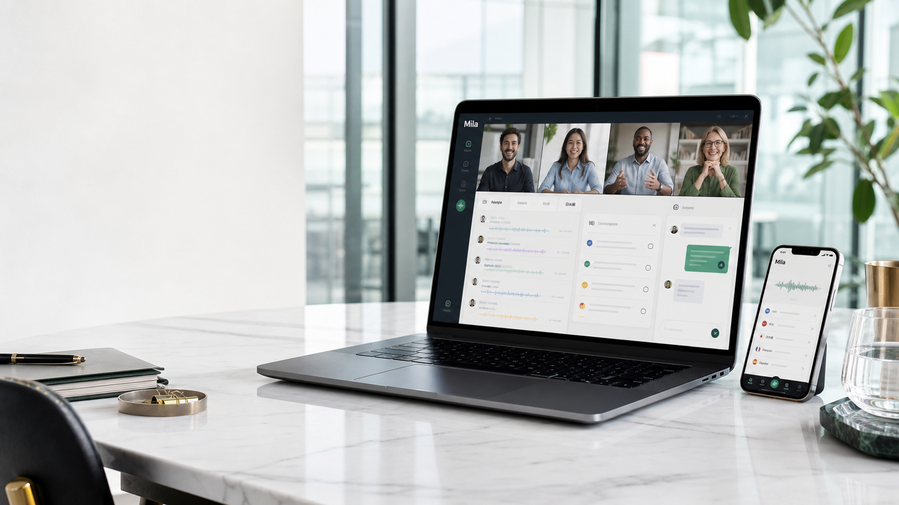

# Mila

Mila is a multilingual AI meeting-notes assistant for live calls and uploaded
conversations. It records audio, transcribes speech with faster-whisper,
generates structured notes with Gemini / OpenRouter / NVIDIA NIM, and ships as
an Electron desktop app backed by a NestJS API, Redis, Postgres with pgvector,
and Docker.

<p>
  
</p>

## What Mila does

- Captures live meeting audio from the desktop app or accepts uploaded audio.
- Produces multilingual transcripts with a faster-whisper ASR worker.
- Generates summaries, decisions, action items, and follow-up notes with LLMs.
- Stores meeting sessions, transcript segments, notes, and action items in
  Postgres, with local pgvector embeddings for meeting search.
- Runs locally as a multi-service stack with Electron, Next.js, NestJS, Redis,
  and Docker Compose.

## Download

Desktop builds are published on the
[GitHub releases page](https://github.com/mzunain/mila/releases/latest). The app
expects a backend reachable at `http://localhost:7400`; use `./run.sh` to start
the local backend stack.

## Architecture at a glance

```
  Electron shell (Mila.app)
    └── embedded Next.js   ── HTTP/WS ──▶   NestJS API   ── HTTP ──▶   faster-whisper worker
                                                │
                                                ├──▶  Postgres (pgvector)
                                                ├──▶  Redis
                                                └──▶  LLM provider (Gemini / OpenRouter / …)
```

The desktop app is a thin client. You always need a backend reachable at
`http://localhost:7400`. For source development, the easiest entrypoint is
`./run.sh`.

## Run locally in one command

Requirements: Docker Desktop (or Docker Engine), Node.js 20.19.0+, and at least
one LLM API key for chat/notes.

```bash
git clone <this repo> mila && cd mila
./run.sh
# or: pnpm start
```

The runner creates `.env` from `.env.example` if needed, generates a local
`JWT_SECRET`, starts Postgres / Redis / ASR in Docker, installs JavaScript
dependencies, applies Prisma migrations, and launches the API plus web UI.

Open:

| Service | URL                              |
| ------- | -------------------------------- |
| Web UI  | http://localhost:7300            |
| API     | http://localhost:7400/api/health |

Useful follow-up commands:

```bash
./run.sh stop         # stop Docker services
./run.sh clean        # stop Docker services and wipe local DB data
./run.sh logs         # follow Docker logs
./run.sh backend      # run Docker backend only, without the web dev server
pnpm bench:live-latency
```

If `.env` was created for you, add at least one provider key such as
`GOOGLE_API_KEY` or `OPENROUTER_API_KEY`; the app can boot without it, but
chat and generated notes need a key.

With the API running, the latency benchmark creates a local test user/session,
sends live transcript chunks over the WebSocket, and reports min/p50/p95/max
delivery times. To include ASR worker latency, run it with
`MILA_BENCH_AUDIO_FILE=/path/to/sample.wav`.

## Start the backend automatically at login (macOS)

The desktop app launches itself at login, but it is a thin client — without the
Docker backend up, sessions fail with a 500 and ASR falls back to mock. To make
MILA start _completely_ after a restart, install a LaunchAgent that brings the
backend stack up headlessly when you log in:

```bash
scripts/install-launch-agent.sh      # install + start now
scripts/uninstall-launch-agent.sh    # remove
```

What it does:

- Writes `~/Library/LaunchAgents/com.mila.backend.plist` (`RunAtLoad`, plus a
  30-minute `StartInterval` so a crashed runtime self-heals).
- At login it runs `scripts/mila-autostart.sh`, which starts the container
  runtime (Colima, or Docker Desktop as a fallback), then `compose up -d` the
  full stack. The `api` container applies Prisma migrations on boot, so the
  database is ready without an extra step.
- Logs to `~/Library/Logs/mila/autostart.{out,err}.log`.

Run it once by hand to verify before relying on it at login:

```bash
scripts/mila-autostart.sh
curl http://localhost:7400/api/health
```

> First run after pulling new code can be slow while images build. Run `./run.sh`
> once to pre-build; afterwards autostart only starts existing containers.

## Docker backend in one command

Requirements: Docker Desktop (or Docker Engine) and at least one LLM API key.

```bash
git clone <this repo> mila && cd mila
cp .env.example .env
# Edit .env — at minimum, set GOOGLE_API_KEY (or OPENROUTER_API_KEY).
# Generate a JWT secret:  openssl rand -hex 48

cd infra
docker compose up -d --build
```

That brings up four services:

| Service      | Port (host) | Notes                                 |
| ------------ | ----------- | ------------------------------------- |
| `api`        | 7400        | NestJS, applies Prisma migrations     |
| `postgres`   | 15432       | Postgres 17, volume `mila-postgres`   |
| `redis`      | 16379       | Cache / pubsub                        |
| `asr-worker` | 9000        | faster-whisper, `tiny` by default     |

Verify:

```bash
curl http://localhost:7400/api/capabilities
# → {"asrProvider":"http","supportsRealAudio":true, ...}
```

Now download Mila.app (or run `pnpm dev:desktop` from source) and it will
connect to the backend at `localhost:7400`.

To stop everything: `docker compose down`. To wipe data too: `docker compose
down -v`.

## Development without Docker

You can run pieces on the host while leaving Postgres / Redis / ASR in
containers.

```bash
# Infra only (postgres on :15432, redis on :16379, asr-worker on :9001)
cd infra && docker compose up -d postgres redis asr-worker && cd -

# Install JS deps
pnpm install

# Apply DB schema (uses DATABASE_URL from .env)
pnpm --filter @mila/api exec prisma migrate deploy

# Run API + Web in watch mode
pnpm dev                # api + web in parallel

# Or in separate terminals
pnpm dev:api
pnpm dev:web
pnpm dev:desktop        # electron shell pointing at host API
```

If you want to run ASR on the host instead of in Docker:

```bash
pnpm dev:asr:native     # binds 127.0.0.1:9000 and preloads Whisper
# then set ASR_BASE_URL=http://127.0.0.1:9000 for the host API
```

## Build the desktop app

```bash
pnpm build:desktop      # compiles TS only
pnpm dist:desktop:mac   # produces apps/electron/out/*.dmg
```

Other targets: `dist:desktop:win`, `dist:desktop:linux`, `dist:desktop:all`.

## Repo layout

```
apps/
  api/              NestJS — REST + WebSocket
  asr-worker/       FastAPI + faster-whisper
  web/              Next.js (embedded in Electron)
  electron/         Desktop shell
  mobile/           Experimental Expo recorder, not part of v0.1 support
  browser-extension/ Experimental Google Meet caption bridge, not supported yet
packages/
  shared/           Types and helpers shared across apps
infra/
  docker-compose.yml          full stack
  docker-compose.override.yml dev port mapping
  db/init.sql                 idempotent schema bootstrap
```

## Common scripts

```bash
pnpm dev              # api + web watch
pnpm build            # shared → api → web
pnpm check            # lint + typecheck + test + build
```

See `package.json` for the full list.

## License

See `LICENSE`.
